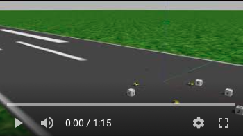

# Gazebo_Simulation

The goal of this project is to developing a visual simulation environment and generate datasets for the collaborative localisation algorithms. To test the collaborative localisation algorithms, there is only one widely used dataset from University of Toronto Institute for Aerospace Studies (UTIAS). It is pretty much the only dataset used by researchers for benchmarking collaborative localisation algorithms. The limitation of that dataset is that it is only in 2D, which is not sufficient for testing algorithms for drones. This project sets up a 3D simulation enviroment which can simulated multiple vehicles and sensors, connect to ardupilot (used in real drones) and log their data. The data can be used to test algorithms for 3D environment.

The following link is the simulated world running in action. 
It includes 4 drones, 3 rovers and 4 landmarks. The drones are set to takeoff and move in a square pattern. All vehicles are moving in the preprogrammed paths. They can also be controlled through MAVproxy terminal.

https://www.youtube.com/watch?v=PZsNeRNcAIM

In the dataset, the ground truth position of each vehicle is included in the file 'gazebo-model_states.csv'.
For each vehicle, its IMU data is saved under 'vehicle-mavros-imu-data.csv'. 
Vehicles' estimated location is saved under 'vehicle-mavros-global_position-local.csv'.
And their uwb ranging measurement is included in 'vehicle_uwb_ranging.csv'.

It is worth mentioning that the orientations of the vehicles are specified in quaternion.
The original ground truth positions are recorded at 1000Hz, which makes the file too big to be uploaded to GitHub.
Thus, the data has been resampled every 250 lines, which makes the frequency 4Hz. 4Hz is still sufficient benchamrking purposes.

The trajectory of each vehicle is plotted.
The trajectory of the drones are plotted in 3D. Whereas the trajectory of the rovers are plotted in 2D, since they only have planar motion.

 
 
 
 
 
 
 

The UWB ranging measurement from each vehicle is also plotted.

 
 
 
 
 
 
 

